**Halloween Prop and Controller project**

## Table of Contents
* [General Info](#general-info)
* [Hardware](#hardware)
* [Software](#software)
* [Directories and files](#directories-and-files)
* [Links](#links)
* [Contacts](#contacts)

# General Info

This project is for a prop controller and an animated prop for Halloween.  The prop is a DIY project that uses as its starting point a female
vampire head from TheHorrorDome.com,  on an approx 4 foot Walgreen's skeleton body.
The goal was to make something scary with lots of life like movement as well as support interactive sessions with Trick-Or-Treaters.

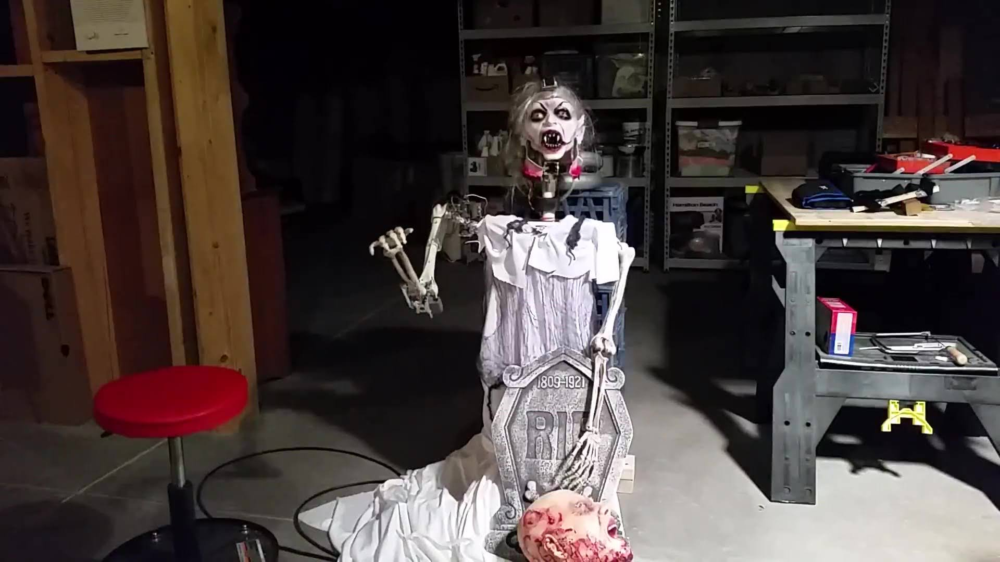  
Figure: Vampire Skeleton Prop

The following are videos of the prop in action:  
[Prop in Action 1](https://photos.app.goo.gl/6Uykd7iYnzz1tLBr7)  
[Prop in Action 2](https://photos.app.goo.gl/xCtqQATjuv2cuCW76)  
[Prop in Action with back movement](https://photos.app.goo.gl/L6dBzxXWFbU8m84k7)  

Servos are used to animate the head, mouth and right arm and elbow.
The prop can both emit audio thru a speaker and listen thru a mic and has red LED eyes that can be turned on or off.
The prop can also, thru pneumatics, lean forward parallel to the ground, or sit upright.
The prop has a minature night vision camera on the top front of its head allowing it to see.  The camera is controlled
thru a smartphone, and allows the user to see what the prop head is seeing and record if desired both audio and video.
    
The controller for the prop is an Arduino Mega 2560 which is used to perform both live interactive
sessions or capture and playback of recorded sessions. Almost all aspects of the prop can be controlled thru
the serial command line interface of the Arduino USB port. The prop can be exactly synchronized to the users
movements thru inertial measurement units (IMUs) attached to the users head and mouth, and eventually ones
attached to the users arm.  This allows for quick, and effortless choreographing of prop movements by matching the users head,
mouth and arm/forearm movements.  This choreographing can be captured for playback later on.
There is an MP3 module the Arduino controls to play audio files to the prop's speaker.

# Hardware

## Prop Head

The prop head starts with a non-animated static female vampire head from TheHorrorDome.com.
Head nod, rotate, and mouth servos are added and attached by custom aluminum brackets along with
Actobotics brackets and hardware to the head and mouth.

The nod servo is in the head as well as the mouth servo. The head nod servo
uses an Actobotics servo block to handle the lateral loads and torques on the servo.  
The inside top of the head is attached via a short PVC pipe embedded in spray insulation foam holding the pipe to the head,
with the other end of the pipe attached to the top of the nod servo block.  The mouth servo does not use a 
servo block as it is only connected to a very light weight mouth.  The mouth is made by cutting out the lower jaw of the vampire head
and gluing it to a curved aluminum bar which then attaches to the mouth servo thru a servo hub.
 
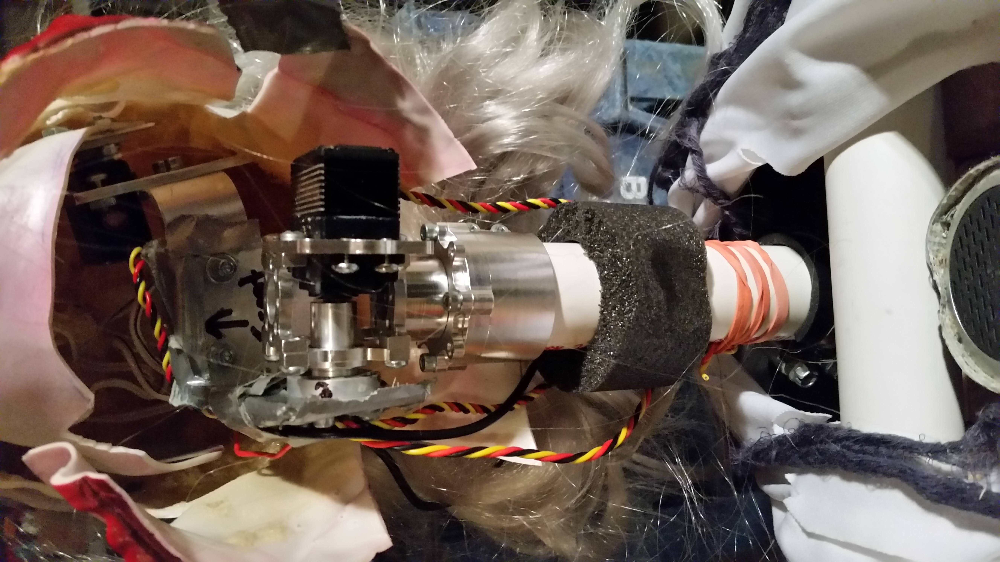  
Figure: Head Nod Servo view 1

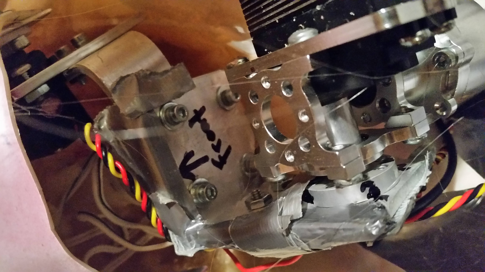  
Figure: Head Nod Servo view 2

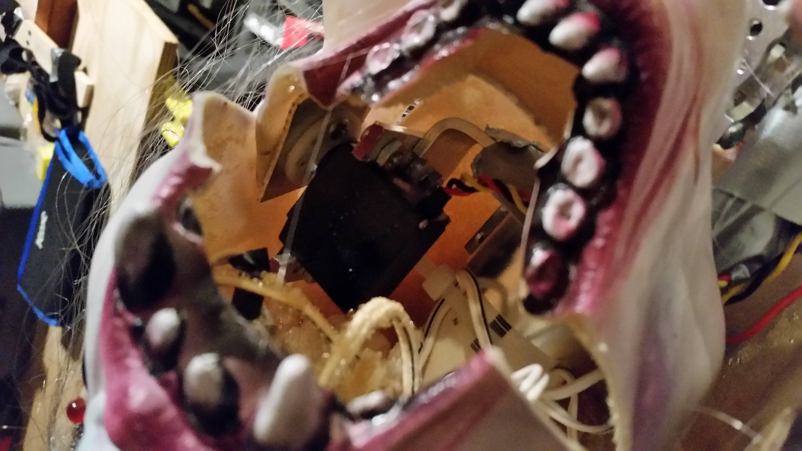  
Figure: Mouth Servo

The head rotate servo is actually located in the prop body in an Actobotics
channel.  It connects with a clamp to a Actobotics metal pipe which is held by two Actobotics pillow block bearings in that channel.  
The end of the metal pipe then connects with a screw clamp and rubber gasket to a PVC pipe slid over the end of it.  The end of the
PVC pipe connects to the bottom of the head nod servo block with a Actobotics PVC clamp hub .  The channel and bearings eliminate
lateral forces on the head rotate servo that can occur when the prop upper body is bent over, and rapidly transitioning between bent over and
straight up.

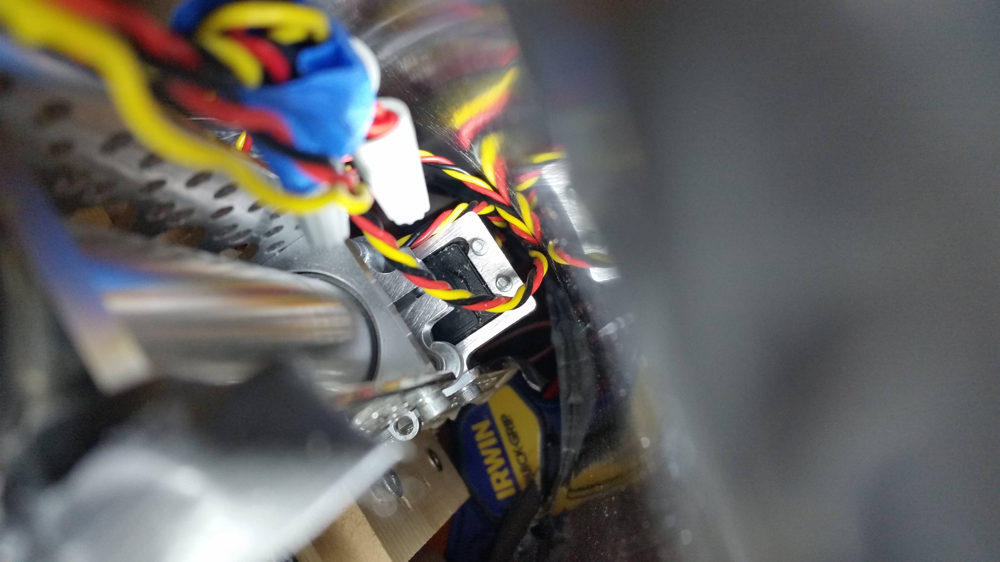  
Figure: Head rotate servo view 1

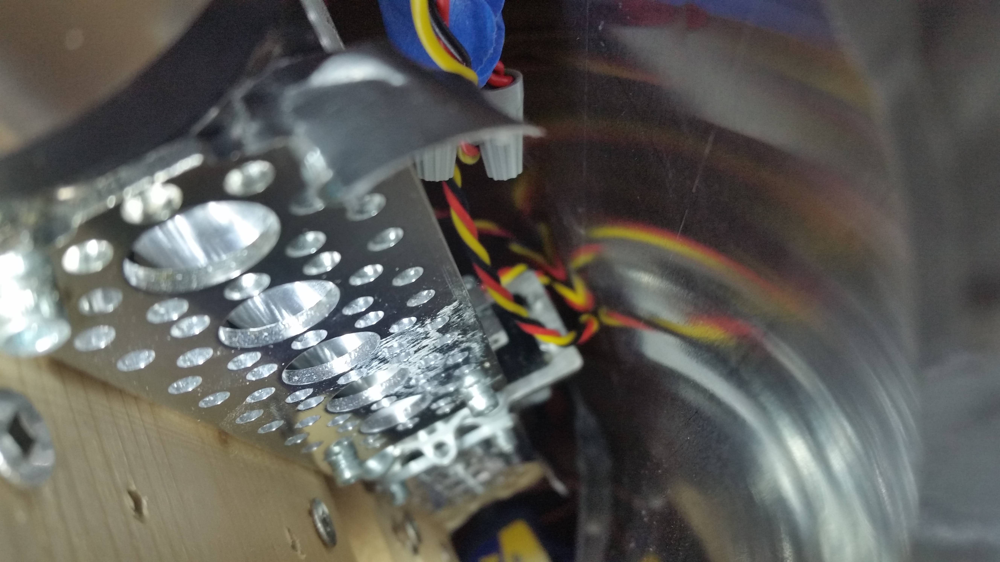  
Figure: Head rotate servo view 2

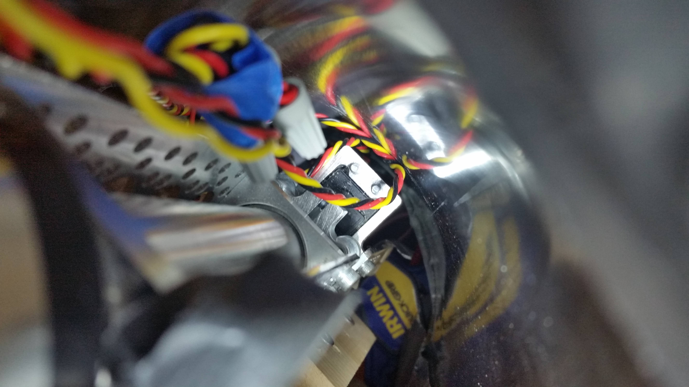  
Figure: Head rotate servo view 3

In regards to the head rotate servo, it was felt at the time that the channel and bearings were necessary to
handle the large lateral forces and lateral torque that could be experienced by the servo.  In hindsight all
that could probably be replaced by a single servo block right at the neck, where the head nod servo block
would then sit on and be attached to the rotating hub of that head rotate servo block.  The servo block at the neck
would also reduce the total lateral torque the servo block would experience being close to the head now, and
thus should be sufficient (same as the head nod servo block is sufficient in that manner).

The head also has red LED
eyes that can be turned on or off although these could instead be connected to a PWM signal or an analog
signal to adjust intensity.  At the top of the head is a Relohas minature night vision camera (a cube that is
0.79 inches long on each side) with a base that is at the back of the head and connected to the camera by a
thin 8" flat cable. The base uses Wifi to conenct to a smartphone.  The base also has a rechargeable battery
in it and a USB connector to charge it. The camera can also be powered by the USB connector which is how it is
currently used.

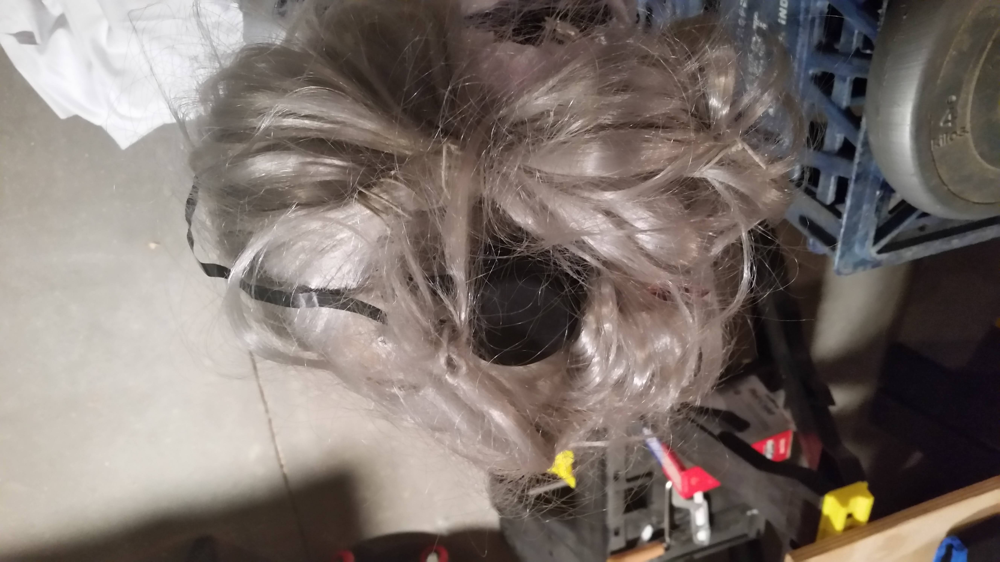  
Figure: Camera Base at back of head

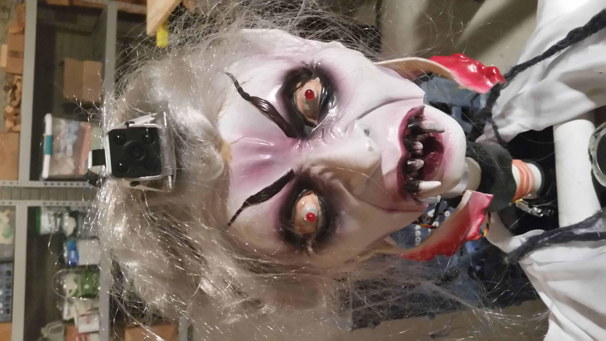  
Figure: Camera at top of head

## Prop Body

The prop skeleton body starts out using a Walgreen's skeleton body rib cage, arms, and legs.
The rib cage is attached to wood and along with a PVC pipe for the shoulder blades make up the upper part of the prop body.
In regards to the rib cage, since it is covered up with the costume, you could probably dispense with it, but at the time I thought
I might have it showing or showing through the costume, at least the outline of the ribs.
The prop skeleton body has the bottoms of the legs bent back on the ground as if the prop is sitting on its knees. These are not
shown in the photos as I just lean them against the sides of the prop.
and lower leg. The body uses an iHome speaker to talk and emit audio,  an Adafruit microphone and amplifier
module with AGC to listen, a pneumatic cylinder, solenoid valves, and air compressor to rotate the upper part of the prop
from a leaning over position, parallel to the ground, to an upright position and vice versa. 

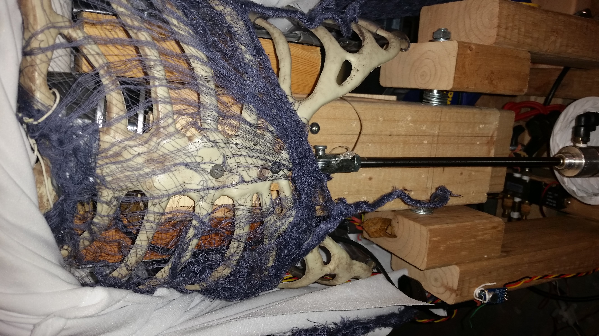  
Figure: Upper Body view 1

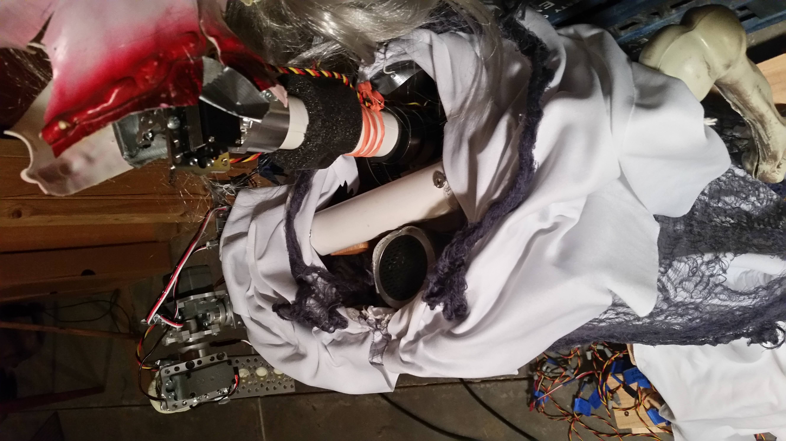  
Figure: Upper Body view 2   
Note the speaker in the middle and the PVC pipe used for the shoulder blade to connect the arms to the prop.

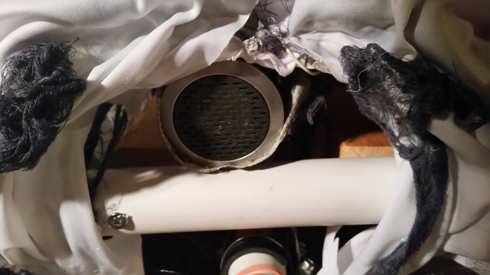  
Figure: Upper Body view 3

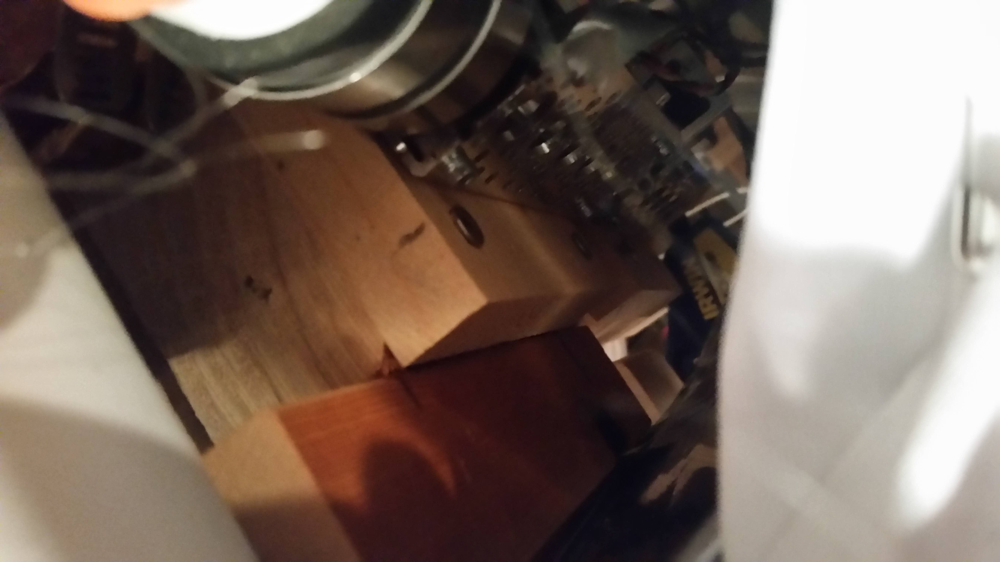  
Figure: Upper Body view 4
 
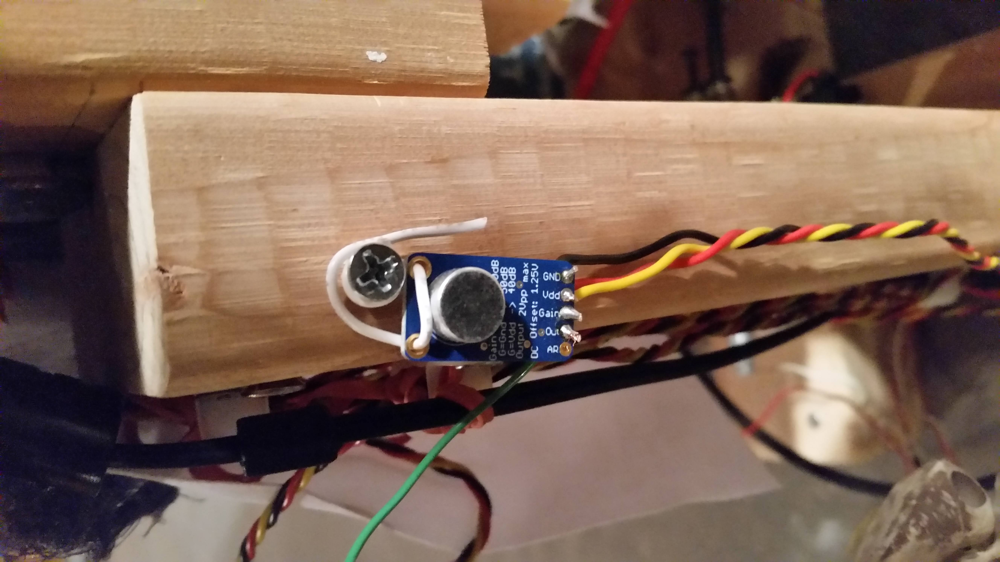  
Figure: Adafruit microphone and amplifier module with AGC to listen
 

The upper part of the body is attached to a base via a bolt hinge
that allows it to swing so it can either be leaning over or upright. The upper body is pushed/pulled by a pneumatic
cylinder to stand upright or lean over. The pneumatic cylinder is controlled by a solenoid valve device which the
main controller controls. The solenoid valve is a 4-Way 5-Port valve with 1/8 Inch ports (part number HB-2A0A) from FrightProps.com.
Elastic cables and air speed mufflers are used to slow the pneumatic
cylinder as it nears its end points, either upright or leaning over. The pneumatic cylinder is covered around with vent dryer exhaust tubing
to keep the cylinder from pinching or pulling the outer costume when the prop is bent over.
The pneumatics have not been used since 2016 
as I have been concentrating on the servo operation.  
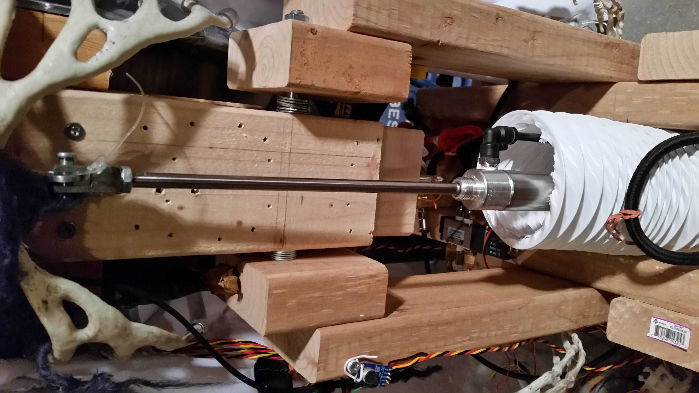  
Figure: Pneumatic Air Cylinder and attachment

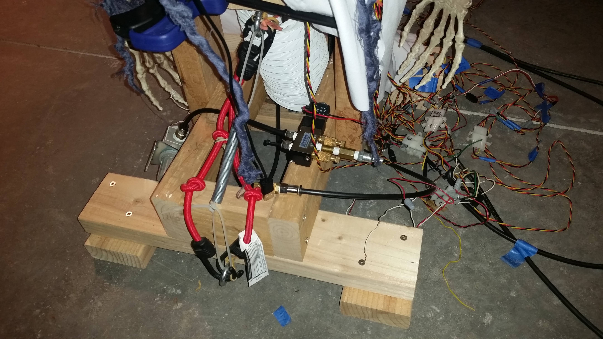  
Figure: 4 way 5 port Solenoid Valve and Base Rear

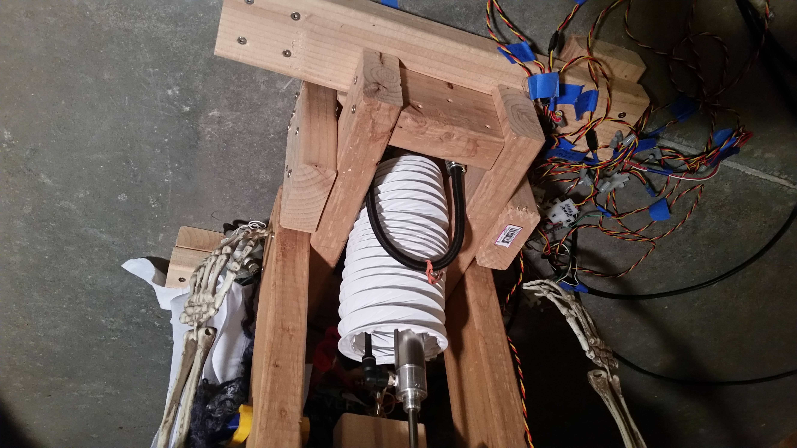  
Figure: Base Front

The right skeleton arm has 3 servos at the
shoulder for pitch, yaw, and roll and one at the elbow to bend the elbow. The shoulder has the yaw servo attached to the PVC
shoulder blade, the roll servo attached to the yaw servos hub, and the pitch servo attached to the roll servos hub.
This seemed to provide the most compact configuration and limited any pulling force on the servo output gear parallel to the axis of the any servo.
All these servos are
held in Actobotics servo blocks to withstand lateral (i.e. perpendicular) forces off the servo axis. Actobotics hardware,
such as screws, hubs, spacers, brackets, channels, flat patterns, attachment blocks, and beams, is used to connect the servo
blocks to the arm and elbow. The attachments are meant to be minimal to leave as much of the skeleton arm visible as possible.
The servos are run at 6 volts with the exception of the arm pitch servo being run at
7.4 volts to get the needed speed and torque. GoBilda servos are used for the arm and elbow, while Hitec are
used for the head and mouth (see Prop Wiring.docx for detail). GoBilda servos are dead quiet when holding a
position, even when under load, so are perfect for the application.  Hitec servos tend to make a high pitched
whine when holding a position under load. Hitec servos were used when the head was first animated before it
was discovered much later on that GoBilda servos would be better in that case.  Eventually the head nod servo
will be replaced with a GoBilda servo as it is the one Hitec servo with the most noticable whine. All the
servos allow a farily fluid/natural/and speedy(when needed) movement of the skeleton head and arm/forearm. 

Note also how the servo wiring is routed.  Generally you want to route servo wire from a servo A that is being rotated by another servo B
as close as possible along servo Bs axis to minimize wires catching on the servos when the servos are being rotated.
Or if motion limits how far a servo can move you an use that to your advantage when routing wires.

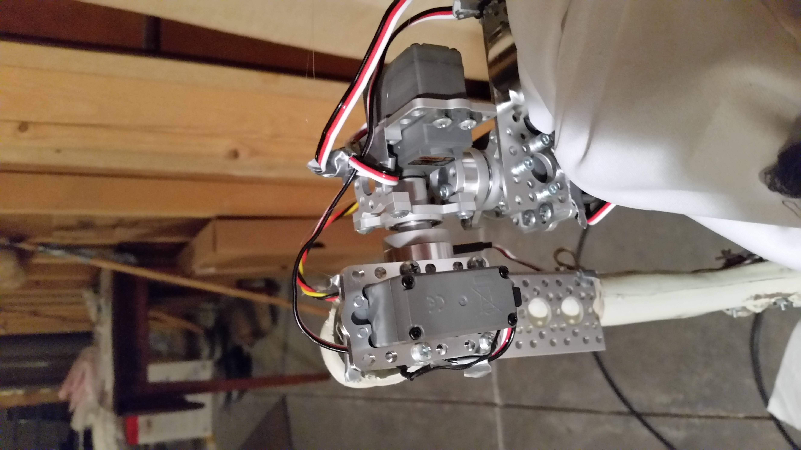  
Figure: Arm servos view 1

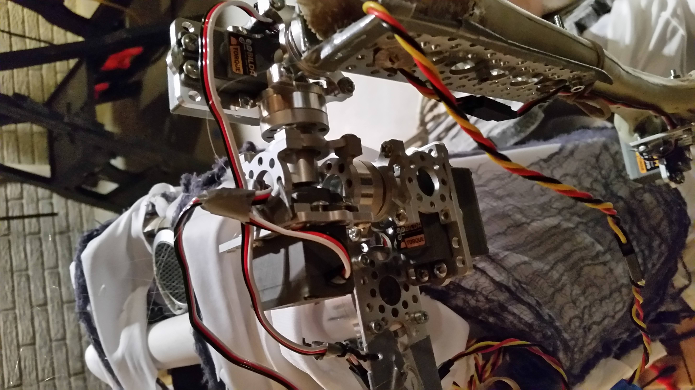  
Figure: Arm servos view 2

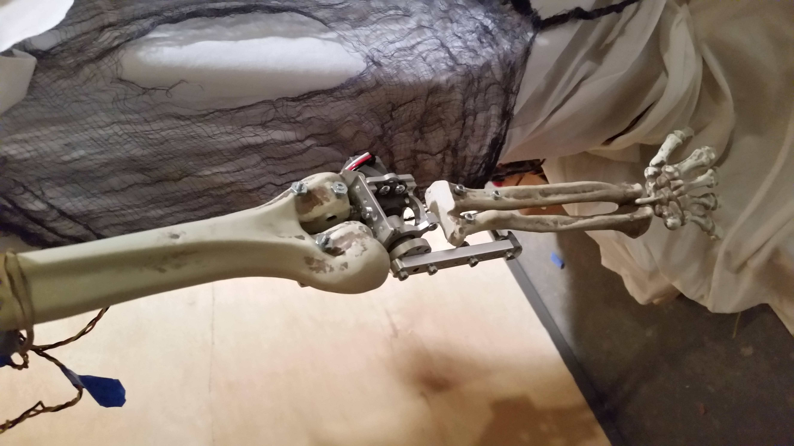  
Figure: Elbow servo

The clothes on the skeleton body came from an old Halloween costume.

## IMUs and Synchronized User Movements

To easily allow a user to naturally manipulate the prop for live interactive sessions as well as catpure
for playback, Adafruit BNO055 Inertial Measurment Units (IMUs) are attached to the user and the servos can
be synchronized to the movements of the user thru the application. Currently 1 IMU is used on the top of the head
using a ball cap,  1 on the mouth using a mouth guard, and two on a simulated arm/forearm in the interim
until I can get them to work on an actual arm.
The Arduino I2C interface is used to access these IMUs.  
  
Figure: IMU attachments

To eliminate orientation issues with the IMUs placed on the user, such as is the head IMU level when the ball
cap is placed on the users head or is the users head pointing north, the user momentarily holds still in a
normally resting/idle position when the synchronization command is given to get a reference frame from which
all further positions (pitch, roll, yaw) are measured relative to.  The user resting/idle positon is normally
head level, looking straight forward, arms straight down at side, and mouth closed. The servos start from their
predetermined normally idle/resting position at the prop and are moved relative to that initial position
using those relative IMU measurements. Thus the user could be oriented any direction initially (body and head
pointing say southwest) and the prop movements are then relative to that initial position.  This eliminates
the user for example from having to face north to use the synchronization.

## Physical Wiring

Currently the controller is connected to the prop thru standard heavy duty twisted servo wire, and thru two 7
wire underground type cables. Standard twisted servo wire consists of 3 wires twisted around each other.  For servos this is used for
power, ground, and signal. Twisted wires help eliminate noise. The servo wires are also used for things
other than the servos as the wire is very flexible and easy to use. The two 7 wire cables are underground type
cables, although not used underground.  The underground type cable was first used for the connections between prop and controller but,
due to the gauge of wire in it, is much less flexible than the servo wire which was used later on.

Both cables and servo wires are about 15 feet in length from controller to prop which was long enough for me
to have the controller inside and the prop outside on the porch with wires going thru a slightly open window.
The goal was to be able to easily look at, probe, and change controller connections to the peripherals, and
connect/disconnect power to the servos without having to do to this at the prop during development, and even
during actual opeartion. The wires from the prop at the controller first connect to a terminal block which
then connect to the Arduino, and peripheral devies. This makes moving connections around easier (at the
terminal block) and also eliminates any pulling stress of wires that go to the Arduino, although wire hold
down brackets and painters/duct tape are used on the wires before they enter the terminal block.

The Arduino and all peripheral hardware are placed on a 1/2 inch piece of plywood to make it easy to transport them all
at once. Connectors are used at the prop to allow all the wires to be easily disconnected from the prop so the
prop can be easily transported. The MP3, I2C switch, user Mic amp, drive circuit for the solenoid valve, and
LED resistors are placed on breadboards to make them easy to connect to.

Currently separate power supplies are used for each servo to eliminate any change of one servo affecting another servo.  
Alternatively you could use one well regulated hefty 6 volt supply and one hefty 7.4 volt supply.

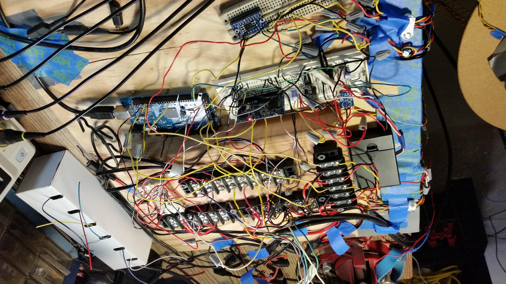  
Figure: Controller, Peripherals, and terminal blocks view 1

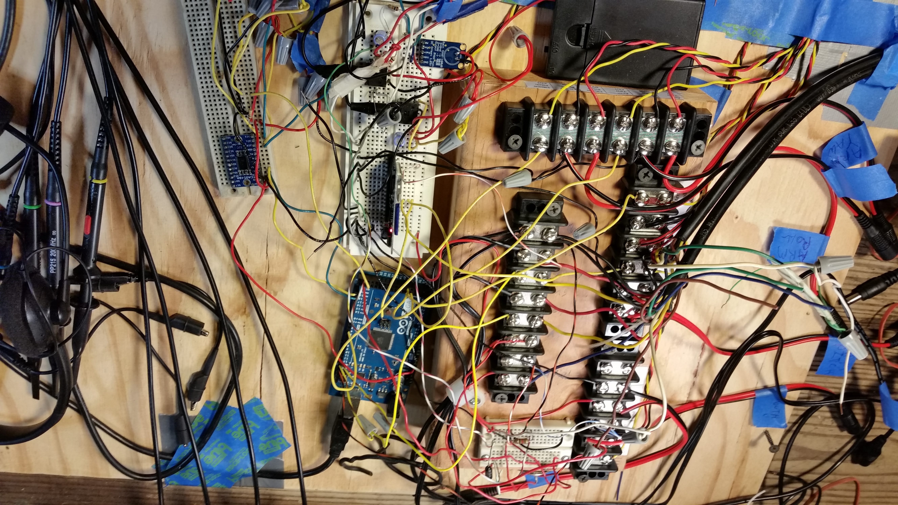  
Figure: Controller, Peripherals, and terminal blocks view 2

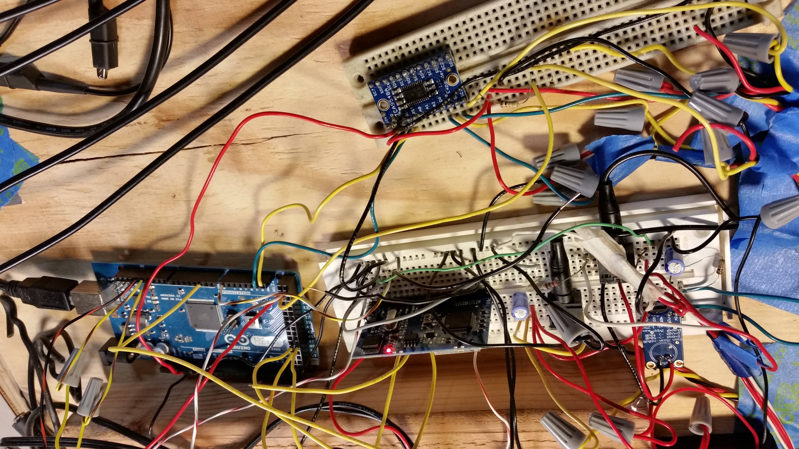  
Figure: Controller, Peripherals, and terminal blocks view 3

## Processor board and Interfaces/Peripherals used

The controller is an Arduino Mega 2560 processor board.  

The Arduino Interfaces used are as follows along with the devices they control:

* 7 of its 12 Pulse Width Modulation (PWM) outputs are used to generate PWM signals for jitter free control of the 7 servos.  
* 1 digital output is used to control the solenoid valve to set the pneumatic cylinder either fully extended or 
fully retracted.  This output goes to a 12V transistor driver circuit with fly back diode then to the solenoid valve in the prop.
* 1 digital output is used to turn the eye LEDs on or off through a resistor.
* The USB connection on the Arduino is used to both program the Arduino and communciate with the running program thru serial commands
and responses
* The I2C bus is used to interface to an I2C switch which interfaces to 2 IMUs
on one channel and 2 on another channel of the switch.  The I2C switch is needed to resolve I2C address
bus conflicts as the IMUs can only have one of two I2C addresses.
* 1 TTL serial interface to control an MP3 module to generate audio and play audio files from an SD card
on the MP3 module.  The audio output of that MP3 goes to the prop speaker
* 1 digital input pulled up to 5 volts and used to read a button.
    
The prop wiring/schematic is contained in the file \Halloween\Prop Wiring.docx

The user has an Adafruit 9814 mic and line amp, with AGC disabled, that is connected thru wires to the prop speaker that allows
the user to talk out of the prop speaker. There is also a MidFly MP3 module that is conencted to the Arduino
and thru wires to the speaker that is used to play mp3 files. Currently for simplicity, only one channel of the MP3 is used 
which goes to one channel of the speaker and the user mic audio goes to the other channel of the speaker.  
The assumption being the MP3 audio is mono.  Also note that the prop speaker does not output stereo and combines its two channels.
Alternatively you can use resistors to allow both channels of the MP3 and Mic to be combined.
The Adafruit talk microphone amplifier small module board is on the upper left of the big breadboard.  To eliminate noise getting into the 
amplified audio it is powered by three 1.5 volt batteries (in the black battery holder box with an on/off switch).
  
The MidFly MP3 module is on the upper right of the big breadboard and contains an SD card.
Also note the user headphone and microphone jacks are on the large breadboard.

# Software

The application is written in Arduino C++ and uses several Arduino libraries, some newly created. 
Except for the majority of the libraries, all code is new. 

The application is written as typical entry-exit state machines which execute very quickly each pass to
conform to the Arduino OS. There is no user threading in the Arduino OS. The Arduino OS has a setup function
and a loop function.  The setup function basically is for initialization and is called once by the Arduino OS
at start up.  The user places their initialization in that setup function.  The loop function is where the
programmers entry-exit state machines are placed.  The Arduino OS calls the loop function continually and does
system housekeeping functions during the rest of the time (with the exception of interrupts of course).
Delaying too long in the loop function could cause issues depending on what Arudino software services you are
using. The code uses classes extensively although there is no 'new' function for the user so classes must be
instantiated at compile time or thru local variables although these local variable of course only persist for the scope they are in and
then are destroyed.

The main program, PropController.ino, supports accepting serial commands to control the prop and peripherals, and outputing serial responses and status.
This main program has top level state machines for
* Prop synchronized to user movements -  Runs when variable AdafruitImuHeadMouthEnabled is true.  Setup by command "ImuHeadMouth ....".
* Calibrating an IMU and getting displaying its  position continuously - Run when Adafruit3DVisualizeEnabled, and setup with command "Visualize3D ...."
* Very limited Prop checkout that Turns the LED eyes on and off as well as setting the back solenoid relay to the back down and back up position.
(Note: do not have the back air cylinder powered by air when doing this as the period between transitions is 1 second)
* Displaying Pitch difference continually between any two IMUs - Runs when AdafruitImusPitchDiffEnabled is true.  Setup by command "ImusShowPitchDiff ..."

The Arduino compiler by default puts large constants declared with the 'const ...' directive in program memory
and then transfers them to RAM at startup to access them in the code like any other variable. So to avoid
chewing up the limited 8K bytes of RAM space of the Mega 2560, the user can instead place large constants in
program memory by using the macro PROGMEMSECTION2 along with the 'const' directive
and then accesses the constant by using the pgm_get_far_address function.  While cumbersome to use, it does keep RAM from being chewed up
by constants.

## Classes

The following are the main user developed application classes:

* Adafruit_BNO055_HalloweenProp -   This class is derived from the Adafruit_BNO055 class.
It additionally accomodates multiple BNO055s with the same I2C address.
This is accomplished using these devices on slave channels of an I2C switch
* base_device - This class is the base class for device write/read functionality.
It is an abstract class requiring a derived class to implement
the certain functionalities.
* devices_player - This class is for playing devices. Each device to be played is registered with this class
along with the values to write (play) and the max number of values for that device.  
Values to write are passed via a reader class derived from the 
indexed_values_reader class to read a device value (to be written) associated with a given index
The class plays the device by calling the devices
write method for the value the reader returns in order waiting interval milliseconds between each set.  All
registered devices are played simultaneously (i.e. Each registerd device is called with its respective
registered reader.read(1) value, and the interval milliseconds is waited, then the same is done for reader.read(2) value, etc.
Playing can be done continuously with wraparound or once stopping at the end of the array.
Wraparound wraps at the end of the max entries for that device.
The playing can also be paused, and then resumed.
The inteval for playing all registered devices can be set (all devices are played at the same
interval)
* imu_filter - This class supports providing a filtered imu output that limits the imu ranges to eliminate imu Euler mapping issues.
* indexed_values_reader - This class is the base class for the indexed values reader functionality.
This class reads a value associated with an index
Derived classes of this allow different constructors to handle different ways the values are stored such as
normal addressable array,  array in PROGMEM, values stored on a SD card, etc.
Thus a class dervied off of this can be instantiated and passed to another class to hide the
mechanics of where the indexed values are stored and how they are accessed.
* LED_device - Derived from base_device to implement the LED on/off functionality
* mp3_device - Derived from base_device and MP3_Player classes to implement the MP3 device functionality
* mp3_Player - Class that is the driver for the MP3 hardware
* NormalArray_values_reader - This indexed_values_reader derived class allows values stored in a normal unit16_t array to be read based on the index
the certain functionalities.
* ProgMemArray_values_reader - This indexed_values_reader derived class allows values stored in a unit16_t array in PROGMEM (program memory) to be read based on the index
the certain functionalities.
* relay_device - Derived from base_device to implement the relay functionality
* servo_device - Derived from base_device and PWMServoNew to implement the servo functionality 
* servo_filter - This class supports providing a filtered servo degree settings output based on the
servo degree settings input given to it, and the filtering parameters setup to it.

## Newly Developed and Modified Libraries

 * PWMServoNew - Refactored version of PWMServo class.  Updated to handle all PWM pins for all Arduinos, and
 refactored to use the new private class avrTimerCounter to interface to the hardware.
 * i2cSwitch - This class handles the physical I2C switch functionality.
Currently this handles a single physical switch (not chained swtiches)
The switch allows a user to connect a master I2C bus up to 8 I2C slave buses , i.e. channels.
Any combination of channels can be enabled/disabled allowing the user to handle
situations such as multiple devices with the same i2C Address (using different channels), or spreading out the
capacitive loading of devices by placing them on different channels so only the 
loading of enabled channel(s) is incurred at any one time.
The user typically will create a set of constants defining the I2C switch channel and mask
combinations to use in another file.  If a class uses a device that is on one of these channels the
appropriate channel and mask constants are generally passed to the class during instantiation and the class handles
setting the appropriate channels in the switch as needed.
* Adafruit_BNO055 - .h file Modified so that the read/write methods are now virtual.  This allows them to be
overriden in a derived class to setup the correct I2C switch channel the IMU is on when performing I2C
read/write operations to it.  A constructor is added to the class Adafruit_BNO055_HalloweenProp dervied from
this to additionally specify the I2C switch address and channel the
IMU is at on that switch.

## Tools

All code was written
using the UltraEdit text editor, although any text editor could be used, and then compiled/built/downloaded using the
Arduino IDE (version 1.8.13 or later).  The Arduino IDE is also used to add new libraries as well as run the serial
command/monitor that the user interfaces to the program with. The Arduino IDE was run on a laptop with a USB serial connection to
the Arduino Mega 2560 board.

Excel spreadsheets were used to manipulate captured playback data for incorporation into the program.  See later on below for the exact
procedure.

Audacity was used to modify/create MP3 files used by the MP3 player.

Visualize 3D Web serial visualizer (https://learn.adafruit.com/adafruit-bno055-absolute-orientation-sensor/webserial-visualizer) can be used
to visualize the orientation of an IMU on a PC when using the Visualize3D serial command.  It can also indicate the IMU calibration status on the PC.

Smartphone app HomeEye, an android camera app, was used to operate the Relohas minature night vision camera.  It allowed both live view and recording of video and
audio. The connection method that worked best to the camera was when the camera was setup as a direct wifi hotspot, so the smartphone wifi
connection was set to that hotspot.  This is an unsecure connection but didn't really matter.  Using a connection where the 
camera was communicating with the my routers wifi and thru the internet seemed to have to much lag and delay for live interaction.  Possibly
with a really good wifi strenght it may have worked better.
When playing back captured videos on the app it was very flakey (continually repeated the start of the video)
 so I had to download them to my PC to play them.  Audio was also not synched with the video sometimes so you may have to 
 use a tool to sync the audio back.  All in all I was not impressed with the app.

## Serial Command Interface

The user can control and monitor the program thru a serial command
line interface on the USB serial line thru the Arduino IDE.
Multiple commands can be entered on a single line with a semicolon between them.
The program communicates with the serial monitor at a 115200 baud rate.
The serial commands are as follows:
    
**ArmPitch _degrees_**  : Sets the Arm pitch servo in degrees

**ArmRoll  _degrees_**  : Sets the Arm roll servo in degrees

**ArmYaw  _degrees_** : Sets the Arm yaw servo in degrees

**AudioBloodCurdlngScream** : Plays the MP3 Blood curdling scream file

**AudioDayO** : Plays the MP3 Harry Belafonti Day-O (Banana Boat Song) file

**AudioHissing** : Plays the MP3 AudioHissing file 

**AudioMoreOftenChewing** : Plays the MP3 More Often Chewing file 

**AudioShakeSenora** : Plays the MP3  Harry Belafonti Shake Senora file

**AudioStop** : Stops the MP3 audio player

**AudioWerewolvesLondon** : Plays the MP3 Werewolves Of London file

**BackDown** : Sets the prop back down parallel to the ground

**BackUp** : Sets the prop back straight up 

**DayOPlayerSetup** : Sets up the prop player for the DayO prop sequence

**Delay15SecPlayOnce** : Delays 15 seconds then plays the player once with whatever was setup.

**DelayMsec _time_** : Delays the time in milliseconds before the next command is executed.

**ElbowPitch _degrees_** : Sets the Elbow pitch servo in degrees

**EyesOff** : Turns the prop LED eyes off

**EyesOn** : Turns the prop LED eyes on 

**HeadHorizontal _degrees_** : Sets the Head horizontal rotate servo in degrees

**HeadVertical _degrees_** : Sets the Head vertical (i.e head nod) servo in degrees

**Imu2Calibrate** : : deprecated - Use ImuCalibrate

**Imu2Read** : Currently does nothing.

**ImuCalibrate _ImuId_** _ImuId_ - the ID number of the IMU to display the summary cal data and detailed cal data for.
Displays the system status, self test result, system error status, system Cal State,  gyro Cal State,  accelerometer Cal State,  magnetometer Cal State
The cal states are as described in the Visualize3D command.  If the IMU is not fully calibrated this command indicates this and does not
return any data.

**ImuGetStoredCalibData _ImuId_** _ImuId_ - the ID number of the IMU to get stored cal data for and set back up in the IMU. 0 = Mouth, 1 = Head, 2 = Arm, 3 = Forearm.

**ImuHeadMouth _periodMsec_ _audioFile_ _audioDelayInPeriods_ _[includeArm]_** : Enables servo movement being synchronized to the corresonding IMUs.
This also continually outputs the servo positions, and audio file start point to the serial monitor so that it can be captured for
incorporation as playback data.   Note: User must be oriented in their normal resting/idle position before
this command is invoked. Use the "DelayMsec xxx" command before this command on the same command line to give
the user time to get into this normal resting/idle position.
* _periodMsec_ - the period in milliseonds to read the IMUs and update the servos.
* _audioFile_ - the ID number of the audio file to play when the command is exeucted.
    * CHEWING_AT_HEAD_FILE            = 5,
    * BLOOD_CURDLING_SCREAM_FILE      = 4,
    * HISSING_FILE                    = 3,
    * MORE_OFTEN_CHEWING_AT_HEAD_FILE = 6,
    * DAYO_FILE                       = 7, 
    * WEREWOLVES_OF_LONDON_FILE       = 8,
    * SHAKE_SHAKE_SENORA_FILE         = 9
* _audioDelayInPeriods_ - The delay in number of _periodMsec_ before the audio file is played.  This allows time for the user to get ready 
before the audio plays.
* _includeArm_ - Optional, defaults to don't include. Indicates if the Arm/Elbow servos are to be synchronzied or left alone.  0 = don't sync 1 = sync

**ImuHeadMouthStop** Stops the servo movement being synchronized to the IMUs.  The servos are left in the position they were at when this 
command was entered.  The ImuHeadMouth operations can also be stopped by pressing a physical button 

**ImuMouthControl** : deprecated - Use ImuHeadMouth

**ImuMouthControlStop** : deprecated - Use ImuHeadMouthStop

**ImuRead _ImuId_** _ImuId_ - the ID number of the IMU to reads and displays the current IMU Yaw, Roll, Pitch angles for.

**ImuSetStoredCalibData  _ImuId_** _ImuId_ - the ID number of the IMU to store its cal data for. 0 = Mouth, 1 = Head, 2 = Arm, 3 = Forearm.
Data is stored in the Arduino non volatile memory.

**ImusShowPitchDiff _periodMsec_ _ImuNumber1_ _ImuNumber2_** : Continually displays the difference between the zero based pitch readings of the two IMUs
The initial pitch readings at the time the command is executed are used as the zero based pitches and the 
difference displayed is (pitch1 - pitch2) - (initial pitch 1 - initial pitch 2).
* _periodMsec_ - the period in milliseonds to get the orientation data.
* _ImuNumber1_ - the ID number of the first IMU to use. 0 = Mouth, 1 = Head, 2 = Arm, 3 = Forearm.
* _ImuNumber2_ - the ID number of the second IMU to use.

**ImusShowPitchDiffStop** : Stops displaying the difference between the pitches (stops the ImusShowPitchDiff command operations)

**Mouth _degrees_** : Sets the Mouth servo in degrees

**PlayOnce** : Plays the pop player once.  This runs the previously setup prop sequence.

**PlayStop** : Stops the prop player.

**VampireArmGraspAtPlayerSetup** : Sets up the prop player for the Vampire grasping and hissing at TOTer prop sequence 

**VampirePlayerSetup** : Sets up the prop player for the Vampire chewing leaned over, pops up straight, then screams and hisses then , pops back down  prop sequence  

**Visualize3D _periodMsec_  _sensorNumber_ _format_** - Starts the Visualize 3D process. This process is
used to calibrate the intertial measurement units (IMUs) and output the current IMU orientation data and calibration status which can also be
used when streamed to a running Visualize 3D Web serial visualizer (https://learn.adafruit.com/adafruit-bno055-absolute-orientation-sensor/webserial-visualizer) on a PC to show the IMU orientation visually with a token object
as well as displaying calibration status on the PC.
Note that calibration does not require the PC program to run as the user can simply look a the serial output calibration status numbers
to determine when the IMU is calibrated.  Likewise the user can look at the output orientation data (pitch, roll, yaw ) in degrees.
Calibration occurs by the user moving the IMU in different orientations to calibrate it.  Leave the IMU still for a few seconds for the gyro to calibrate.
Then move the IMU around to calibrate the magnetometer.  The accelerometer takes the longest to calibrate and
requires putting the IMU about 45 degrees about each side of the x, y, z axis's of the IMU letting it sit at
least 5 seconds at each orientation or doing figure 8s with it.  Note that the magnetometer can be affected by
nearby magnetic fields generated by laptops, magnets, etc.  So when calibrating the IMU, and during operation, keep the IMU away from those sources. 

* _periodMsec_ - the period in milliseonds to get the calibration and orientation data and output it.
* _sensorNumber_ - the ID number of the IMU to use. 0 = Mouth, 1 = Head, 2 = Arm, 3 = Forearm.
* _format_ - The orientation format to get or use.   0 = direct Euler where the Euler angles are read directly
from the IMU, 1 = quaternions converted to Euler where quaternions are read from the IMU and then converted to Euler angles,

The orientation data is output as Yaw, Roll, Pitch in degrees.  The calibration data is output as system cal number, gyro cal number, accelerometer cal number,
magnetometer cal number.  Each calibration (cal) number ranges from 0 to 3 with 0 being not calibrated and 3 being fully calibrated.
Calibration can be speed up by saving off and restoring the calibrated data using the ImuSetStoredCalibData, and the ImuGetStoredCalibData
commands respectively. 

**Visualize3DStop** : Stops Visualize3D operations.

**WerewolvesLondonPlayerSetup** : Sets up the prop player for the Werewolves of London prop sequence
    
    
## Prop Playback Data 
   
Prop playback data is currently stored as constant arrays in the program itself
although the future goal is to store it on a separate SD card the Arduino accesses for unlimited playback
storage. These constants are currently stored in the PROGMEM2 section of the code, using the PROGMEMSECTION2 macro, so they
don't take up RAM space, only program code space. 

## Capturing Playback Data and Adding it to the Program 
   
When using live interactive prop movement operations (i.e. command "ImuHeadMouth ...") the large output on the
serial monitor that shows the servo positions, etc, can be captured by copying and pasting it into a text
file. This can then be opened as an Excel file and its contents copied to sheet VampireArmCapture of the excel
file VampireArmCapture.xlsx. Once that is done the user can copy and transpose paste it from sheet
VampireArmCapture to sheet 1 in the appropriate spot. At that point copy and paste from sheet 1 to the
appropriate row in sheet 2.
Then sheet 2 has the code snippet you can copy and paste into the PropController.ino file for accessing it in the code for playback later on.

## Licenses

Any new code uses the MIT software license.

# Lessons Learned

Lessons learned as well as future enhancements are contained in the file \Halloween\Lessons Learned.docx.
    
# Directories and files

\Halloween\PropController\ - Dir that contains the software program.  The Arduino PropController.ino (main file) and its
    supporting user files are contained here.
    
\Halloween\NewAndModedLibraries\ - Dir that contains new or modified libraries.  These are then zipped and imported into the
    Arduino IDE using the Sketch --> Include Library --> Add .Zip Library ...  item of the IDE.
    
\Halloween\QuickHeadMouthCaptureCommands.txt  - File that contains serial commands that were commonly used for prop operation on Halloween.

\Halloween\Prop Wiring.docx  - MS Word file that contains the prop wiring information/schematic.

\Halloween\ArmServoAngularAccelCalcs.xlsx - Excel file containing torque and speed calculations for the servos.  Also contains servo
    min,max degree and PWM pulse width calculations used when instantiating servo objects.
    
\Halloween\*.mp3  - mp3 audio files that can be placed on the MP3 SD card renamed as 1.mp3, 2.mp3, etc,
which the prop controller can direct the MP3 module to play.

\Halloween\Lessons Learned.docx -  A lessons learned file along with future enhancements.

There are several other files and directories in \Halloween\ but the significant ones are listed above.
    
# Links

[Halloween Prop](https://photos.app.goo.gl/th4qkniJdXuoBmHA6) -  contains photos of the controller and
prop as well as some videos of the prop in action and demos of its range of motion.
    
[Halloween 2018](https://photos.app.goo.gl/2tGpkc9Z9Mq6irJE6) -
Videos of the prop before arm movement was added.

[Halloween 2016](https://photos.app.goo.gl/JRoNFRmu7PUxWUwC9) - Video of the prop with back movement, but before arm and mouth movement added
        
# Contacts

Greg Gemmer: ghgemmer@gmail.com